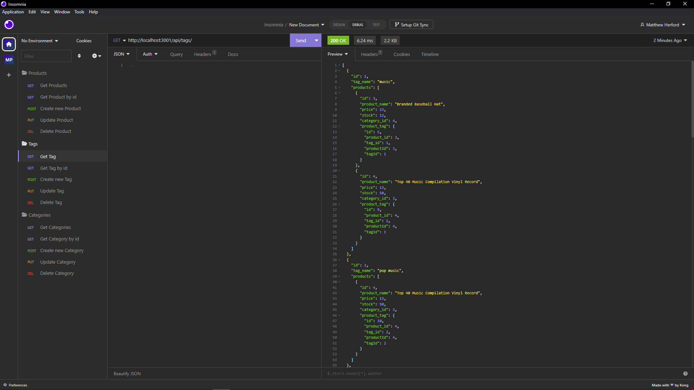

# E-commerce backend app

## Requirements
the objective of this activity was to create a backend for an e-commerce buisness. my goal was to create api routes to write, fetch, update, or delete information from a database using sequalizer and express.js. There should be routes individually for products, tags, and categories. and the should be relational to each other. 

## Screenshots

## Videos
[https://youtu.be/kY8rsx1EcHM]

## Github
[https://github.com/shyguyMatt/E-commerce-backend]
